+++
title = "初入分页"
weight = 8
path = "paging-introduction"
date = 2019-01-14

[extra]
chapter = "内存管理"
# Please update this when updating the translation
translation_based_on_commit = "81d4f49f153eb5f390681f5c13018dd2aa6be0b1"
# GitHub usernames of the people that translated this post
translators = ["byacrya"]
+++

本篇博文将介绍我们将使用的**分页**技术，这是一种常见于操作系统中的内存管理方式。本文阐述了为何需要内存管理、**分段**是如何运作的、**虚拟内存**是什么，以及分页是如何解决内存碎片问题的。本文还将带您探索 x86_64 架构上的多层级内存分页表的布局。

<!-- more -->

此博客已在 [GitHub] 上开源。若您有任何问题或疑问，请在 GitHub 上提出议题 (Issue)，同时您也可以[在下方]留言。此篇文章的完整代码可在 [`post-08` 分支][博文分支]上找到。

[GitHub]: https://github.com/phil-opp/blog_os
[在下方]: #comments
<!-- fix for zola anchor checker (target is in template): <a id="comments"> -->
[博文分支]: https://github.com/phil-opp/blog_os/tree/post-08

<!-- toc -->

## 内存保护

操作系统的一项重大任务是隔离不同的应用。比如按理来说，你的浏览器不应该会妨碍到你的编辑器。为此，操作系统使用硬件特性来确保一个进程无法访问其他进程的内存区域。根据硬件和操作系统的不同，其实现方法也各不相同。

举个例子，部分 ARM Cortex-M 处理器 (常用于嵌入式系统) 自带[**内存保护单元**] (MPU)，开发者可借此通过设定不同的数字 (如 8) 为内存区域设定不同的访问权限 (如不可访问、只读、读取和写入)。在每次访问内存时，保护单元会确保要访问的地址位于带有正确访问权限的内存区域内，否则将抛出异常。通过在每次进程切换时更换内存区域及其相应权限，操作系统得以确保每个进程仅能访问其自己的内存区域，进而将不同的进程隔离开来。

[**内存保护单元**]: https://developer.arm.com/docs/ddi0337/e/memory-protection-unit/about-the-mpu

在 x86 架构上，硬件支持两种不同的内存保护方式：[分段]和[分页].

[分段]: https://zh.wikipedia.org/wiki/X86%E8%A8%98%E6%86%B6%E9%AB%94%E5%8D%80%E6%AE%B5
[分页]: https://zh.wikipedia.org/wiki/%E8%99%9A%E6%8B%9F%E5%86%85%E5%AD%98

## 分段

分段是早在 1978 年就提出的概念，起初是为了增加可寻址的内存数量。当时的处理器使用的是 16 位的内存地址，所以可寻址的内存量被限制在了 64 KiB。为解决此问题，工程师们引入了额外的段寄存器，每个寄存器中存有内存偏移地址。CPU 会在每次访问内存时加上此偏移量，最终将可寻址的内存量扩大到了 1 MiB。

根据内存访问类型的不同，CPU 会自动选取合适的段寄存器完成操作：获取指令使用代码段寄存器 `CS`，而栈操作 (push/pop) 使用栈段寄存器 `SS`。其他指令则使用数据段寄存器 `DS`，或是额外段寄存器 `ES`。在此之后，工程师们又加入了两个可自由使用的段寄存器，`FS` 和 `GS`。

在初代的分段技术中，段寄存器仅包含内存偏移量，而不进行访问控制。[**保护模式**]的引入改变了这一切。当处理器运行于保护模式时，段描述符 (segment descriptor) 存有指向局部或全局[**描述符表**]的索引。描述符表除了存有偏移地址外，还同时存有段大小及访问权限。通过为不同的进程载入不同的全局/局部描述符表，操作系统可以将进程的内存访问限制在其自己的内存区域内，继而隔离不同的进程。

[**保护模式**]: https://zh.wikipedia.org/wiki/X86%E8%A8%98%E6%86%B6%E9%AB%94%E5%8D%80%E6%AE%B5#80286%E4%BF%9D%E8%AD%B7%E6%A8%A1%E5%BC%8F
[**描述符表**]: https://zh.wikipedia.org/wiki/%E5%85%A8%E5%B1%80%E6%8F%8F%E8%BF%B0%E7%AC%A6%E8%A1%A8

此外，分段技术通过修改实际访问前的内存地址的方式，实际上已经引入了现今最常用的内存技术之一——**虚拟内存**。

### 虚拟内存

虚拟内存的理念是将内存地址从实际的存储设备上抽象出来，使内存访问不再直接，而需经过一次地址翻译。对于分段来说，翻译步骤只需要加上当前活跃段的偏移地址即可。假设一个程序需要访问段偏移量为 `0x1111000`，段内内存地址为 `0x1234000` 的区域，其实际访问的地址则为 `0x2345000`。

为了便于区分，我们将未翻译和翻译后的内存地址分别称为**虚拟**和**物理**内存地址。这两者的一大差异在于后者总是指向相同且独特的内存位置；而前者则根据翻译过程的不同而不同。两个虚拟内存地址完全有可能指向相同的物理内存地址，而不同的翻译过程也可能让两个相同的虚拟地址指向不同的物理地址。

下方是此性质在两个并行运行的同一程序中得以体现的示例：



上方是一个程序运行两次，但翻译过程不同的例子。第一个程序实例的段偏移量为 100，故其虚拟地址 0–150 被翻译到了物理地址 100–250。第二个实例的偏移量为 300，其虚拟地址 0–150 则对应物理地址 300–450。虚拟内存使得操作系统可以在两个相同的虚拟地址上，运行两个具有相同代码的程序，而无需担心它们会相互干扰。

另外一个使用虚拟内存的优点则是，使用不同虚拟内存地址的程序可以被分配到任意的物理内存地址。这样，操作系统可以利用所有可用的内存，而无需重新编译程序。

### 内存碎片

虚拟和物理地址之间的差异让内存分段变得十分强大。但是，这也导致了内存碎片问题。为了举例，我们再在上方的例子中引入第三个程序：



可以看出，虽然我们有足够的内存空间，但除非我们将几个实例的内存重叠，否则我们无法在此例中将第三个程序实例的虚拟内存映射到物理内存。此处的问题在于，我们需要**连续**的内存，而不能使用剩余的小内存块。

解决此问题的方法之一是暂停程序执行，将使用中的内存贴到一起，更新内存映射，再继续执行：



现在我们便有足够的连续空间去运行第三个程序了。

去碎片化的劣势是在于其需要复制大量内存，而这会降低性能。在碎片过多的情况下，系统还需大量进行此过程，导致程序运行暂停，系统甚至无法响应。

因此，碎片问题是大多数系统不再使用分段技术的原因之一。实际上，x86 的 64 位模式甚至已不再支持分段，而是使用**分页**技术，这完全避免了碎片问题。

## 分页

分页将虚拟和物理内存空间划分为固定大小的小块，虚拟内存中的块被称为**页**，而物理内存中的块被称为**页框** (又译为**帧**)。每一页都可被单独映射到一个页框，让即使不连续的物理内存页框也可以被划分出更大的内存区域。 

回想上文所述的碎片空间，使用分页替代分段技术的优势便显而易见：



本例中，页的大小为 50 字节，即内存区域被划分为了三页。每一页都单独映射到一页框，连续的虚拟内存空间因此可被映射到非连续的物理页框。于是，我们可以运行第三个程序，而不需要进行任何的去碎片化操作。

### 隐蔽碎片

相较于分段而言，分页使用固定大小的小内存区域，而非大小不定的大内存区域。由于每一个页框大小都相同，所以没有哪一个页框会变成碎片，对吗？

看似如此，实则不然。这里仍存在名为**内部碎片**的隐藏碎片。这是由于每个内存区域的大小不是页大小的整数倍所导致的。我们继续使用上文中的例子，并假设程序内存占用为 101 字节：此时需要三个大小为 50 字节的页，于是程序会多占用 49 字节的内存。同样，为区分上述两种碎片的不同，我们将使用段技术所产生的碎片称做**外部碎片**。

总之，碎片问题依旧存在，但内部碎片相较段技术产生的外部碎片要好，因为它并不需要去碎片化处理，而且碎片数量可以预测 (平均每个内存区域存在半页碎片)。

### 分页表

从上文中我们可以得出，不计其数的页都可以对应到一个页框，而这些映射信息需要存储到一个地方。段使用单独的段选择寄存器存储活跃中的内存区域，而分页需要存储大量的页，只用几个寄存器自然不太现实。所以，分页技术选择使用**分页表**来存储映射信息。

上例中的分页表如下图所示：


我们可以看到，每个实例有着自己的分页表，而指向当前活跃分页表的指针存储在一个特殊的 CPU 寄存器中。在 `x86` 平台上，此寄存器叫做 `CR3`。操作系统需要在运行程序前将寄存器中的指针指向正确的分页表。

每次访问内存时，处理器会从此寄存器中读取页表指针并查找内存页所对应的页框。这一操作完全由硬件完成，且对系统中所运行的程序完全不可见。为了提高翻译效率，大部分 CPU 架构都使用一个特殊的缓存来暂存上次翻译的结果。

根据架构的不同，分页表中的记录也可能存储其他属性，比如访问权限。在上述的例子中，"读/写"标记表示此页既可读也可写。

### 多层分页表

当上文中提到的分页表遇到大地址空间时会存在一个问题：浪费内存。我们假设一个程序使用虚拟页 `0`、`1_000_000`、`1_000_050` 和 `1_000_100` (此处使用 `_` 分隔千分位)：


此例中，我们只需要四个物理页框，但分页表却记录了上百万个项。我们无法略过空项，否则 CPU 在翻译过程中无法跳到正确的页 (即不再保证第四个页使用第四个项)。

所以，为了减少浪费的内存，我们转而使用**两级页表**，用多出的二级页表来保存内存地址与(一级)页表之间的映射关系。

我们来举个例子：首先，我们定义每个一级页表寄存 `10_000` 大小的内存。此时的分页表如下所示：


页 0 处于第一个 `10_000` 字节区域，所以其使用二级分页表的首项。此项又指向一级页表 T1，将页 `0` 指向物理页框 `0`。

The pages `1_000_000`, `1_000_050`, and `1_000_100` all fall into the 100th `10_000` byte region, so they use the 100th entry of the level 2 page table. This entry points to a different level 1 page table T2, which maps the three pages to frames `100`, `150`, and `200`. Note that the page address in level 1 tables does not include the region offset. For example, the entry for page `1_000_050` is just `50`.

We still have 100 empty entries in the level 2 table, but much fewer than the million empty entries before. The reason for this savings is that we don't need to create level 1 page tables for the unmapped memory regions between `10_000` and `1_000_000`.

The principle of two-level page tables can be extended to three, four, or more levels. Then the page table register points to the highest level table, which points to the next lower level table, which points to the next lower level, and so on. The level 1 page table then points to the mapped frame. The principle in general is called a _multilevel_ or _hierarchical_ page table.

Now that we know how paging and multilevel page tables work, we can look at how paging is implemented in the x86_64 architecture (we assume in the following that the CPU runs in 64-bit mode).

## Paging on x86_64

The x86_64 architecture uses a 4-level page table and a page size of 4&nbsp;KiB. Each page table, independent of the level, has a fixed size of 512 entries. Each entry has a size of 8 bytes, so each table is 512 * 8&nbsp;B = 4&nbsp;KiB large and thus fits exactly into one page.

The page table index for each level is derived directly from the virtual address:


We see that each table index consists of 9 bits, which makes sense because each table has 2^9 = 512 entries. The lowest 12 bits are the offset in the 4&nbsp;KiB page (2^12 bytes = 4&nbsp;KiB). Bits 48 to 64 are discarded, which means that x86_64 is not really 64-bit since it only supports 48-bit addresses.

Even though bits 48 to 64 are discarded, they can't be set to arbitrary values. Instead, all bits in this range have to be copies of bit 47 in order to keep addresses unique and allow future extensions like the 5-level page table. This is called _sign-extension_ because it's very similar to the [sign extension in two's complement]. When an address is not correctly sign-extended, the CPU throws an exception.

[sign extension in two's complement]: https://en.wikipedia.org/wiki/Two's_complement#Sign_extension

It's worth noting that the recent "Ice Lake" Intel CPUs optionally support [5-level page tables] to extend virtual addresses from 48-bit to 57-bit. Given that optimizing our kernel for a specific CPU does not make sense at this stage, we will only work with standard 4-level page tables in this post.

[5-level page tables]: https://en.wikipedia.org/wiki/Intel_5-level_paging

### Example Translation

Let's go through an example to understand how the translation process works in detail:


The physical address of the currently active level 4 page table, which is the root of the 4-level page table, is stored in the `CR3` register. Each page table entry then points to the physical frame of the next level table. The entry of the level 1 table then points to the mapped frame. Note that all addresses in the page tables are physical instead of virtual, because otherwise the CPU would need to translate those addresses too (which could cause a never-ending recursion).

The above page table hierarchy maps two pages (in blue). From the page table indices, we can deduce that the virtual addresses of these two pages are `0x803FE7F000` and `0x803FE00000`. Let's see what happens when the program tries to read from address `0x803FE7F5CE`. First, we convert the address to binary and determine the page table indices and the page offset for the address:


With these indices, we can now walk the page table hierarchy to determine the mapped frame for the address:

- We start by reading the address of the level 4 table out of the `CR3` register.
- The level 4 index is 1, so we look at the entry with index 1 of that table, which tells us that the level 3 table is stored at address 16&nbsp;KiB.
- We load the level 3 table from that address and look at the entry with index 0, which points us to the level 2 table at 24&nbsp;KiB.
- The level 2 index is 511, so we look at the last entry of that page to find out the address of the level 1 table.
- Through the entry with index 127 of the level 1 table, we finally find out that the page is mapped to frame 12&nbsp;KiB, or 0x3000 in hexadecimal.
- The final step is to add the page offset to the frame address to get the physical address 0x3000 + 0x5ce = 0x35ce.


The permissions for the page in the level 1 table are `r`, which means read-only. The hardware enforces these permissions and would throw an exception if we tried to write to that page. Permissions in higher level pages restrict the possible permissions in lower levels, so if we set the level 3 entry to read-only, no pages that use this entry can be writable, even if lower levels specify read/write permissions.

It's important to note that even though this example used only a single instance of each table, there are typically multiple instances of each level in each address space. At maximum, there are:

- one level 4 table,
- 512 level 3 tables (because the level 4 table has 512 entries),
- 512 * 512 level 2 tables (because each of the 512 level 3 tables has 512 entries), and
- 512 * 512 * 512 level 1 tables (512 entries for each level 2 table).

### Page Table Format

Page tables on the x86_64 architecture are basically an array of 512 entries. In Rust syntax:

```rust
#[repr(align(4096))]
pub struct PageTable {
    entries: [PageTableEntry; 512],
}
```

As indicated by the `repr` attribute, page tables need to be page aligned, i.e., aligned on a 4&nbsp;KiB boundary. This requirement guarantees that a page table always fills a complete page and allows an optimization that makes entries very compact.

Each entry is 8 bytes (64 bits) large and has the following format:

Bit(s) | Name | Meaning
------ | ---- | -------
0 | present | the page is currently in memory
1 | writable | it's allowed to write to this page
2 | user accessible | if not set, only kernel mode code can access this page
3 | write through caching | writes go directly to memory
4 | disable cache | no cache is used for this page
5 | accessed | the CPU sets this bit when this page is used
6 | dirty | the CPU sets this bit when a write to this page occurs
7 | huge page/null | must be 0 in P1 and P4, creates a 1&nbsp;GiB page in P3, creates a 2&nbsp;MiB page in P2
8 | global | page isn't flushed from caches on address space switch (PGE bit of CR4 register must be set)
9-11 | available | can be used freely by the OS
12-51 | physical address | the page aligned 52bit physical address of the frame or the next page table
52-62 | available | can be used freely by the OS
63 | no execute | forbid executing code on this page (the NXE bit in the EFER register must be set)

We see that only bits 12–51 are used to store the physical frame address. The remaining bits are used as flags or can be freely used by the operating system. This is possible because we always point to a 4096-byte aligned address, either to a page-aligned page table or to the start of a mapped frame. This means that bits 0–11 are always zero, so there is no reason to store these bits because the hardware can just set them to zero before using the address. The same is true for bits 52–63, because the x86_64 architecture only supports 52-bit physical addresses (similar to how it only supports 48-bit virtual addresses).

Let's take a closer look at the available flags:

- The `present` flag differentiates mapped pages from unmapped ones. It can be used to temporarily swap out pages to disk when the main memory becomes full. When the page is accessed subsequently, a special exception called _page fault_ occurs, to which the operating system can react by reloading the missing page from disk and then continuing the program.
- The `writable` and `no execute` flags control whether the contents of the page are writable or contain executable instructions, respectively.
- The `accessed` and `dirty` flags are automatically set by the CPU when a read or write to the page occurs. This information can be leveraged by the operating system, e.g., to decide which pages to swap out or whether the page contents have been modified since the last save to disk.
- The `write through caching` and `disable cache` flags allow to control the caches for every page individually.
- The `user accessible` flag makes a page available to userspace code, otherwise it is only accessible when the CPU is in kernel mode. This feature can be used to make [system calls] faster by keeping the kernel mapped while a userspace program is running. However, the [Spectre] vulnerability can allow userspace programs to read these pages nonetheless.
- The `global` flag signals to the hardware that a page is available in all address spaces and thus does not need to be removed from the translation cache (see the section about the TLB below) on address space switches. This flag is commonly used together with a cleared `user accessible` flag to map the kernel code to all address spaces.
- The `huge page` flag allows to create pages of larger sizes by letting the entries of the level 2 or level 3 page tables directly point to a mapped frame. With this bit set, the page size increases by factor 512 to either 2&nbsp;MiB = 512 * 4&nbsp;KiB for level 2 entries or even 1&nbsp;GiB = 512 * 2&nbsp;MiB for level 3 entries. The advantage of using larger pages is that fewer lines of the translation cache and fewer page tables are needed.

[system calls]: https://en.wikipedia.org/wiki/System_call
[Spectre]: https://en.wikipedia.org/wiki/Spectre_(security_vulnerability)

The `x86_64` crate provides types for [page tables] and their [entries], so we don't need to create these structures ourselves.

[page tables]: https://docs.rs/x86_64/0.14.2/x86_64/structures/paging/page_table/struct.PageTable.html
[entries]: https://docs.rs/x86_64/0.14.2/x86_64/structures/paging/page_table/struct.PageTableEntry.html

### The Translation Lookaside Buffer

A 4-level page table makes the translation of virtual addresses expensive because each translation requires four memory accesses. To improve performance, the x86_64 architecture caches the last few translations in the so-called _translation lookaside buffer_ (TLB). This allows to skip the translation when it is still cached.

Unlike the other CPU caches, the TLB is not fully transparent and does not update or remove translations when the contents of page tables change. This means that the kernel must manually update the TLB whenever it modifies a page table. To do this, there is a special CPU instruction called [`invlpg`] (“invalidate page”) that removes the translation for the specified page from the TLB, so that it is loaded again from the page table on the next access. The TLB can also be flushed completely by reloading the `CR3` register, which simulates an address space switch. The `x86_64` crate provides Rust functions for both variants in the [`tlb` module].

[`invlpg`]: https://www.felixcloutier.com/x86/INVLPG.html
[`tlb` module]: https://docs.rs/x86_64/0.14.2/x86_64/instructions/tlb/index.html

It is important to remember to flush the TLB on each page table modification because otherwise the CPU might keep using the old translation, which can lead to non-deterministic bugs that are very hard to debug.

## Implementation

One thing that we did not mention yet: **Our kernel already runs on paging**. The bootloader that we added in the ["A minimal Rust Kernel"] post has already set up a 4-level paging hierarchy that maps every page of our kernel to a physical frame. The bootloader does this because paging is mandatory in 64-bit mode on x86_64.

["A minimal Rust kernel"]: @/edition-2/posts/02-minimal-rust-kernel/index.md#creating-a-bootimage

This means that every memory address that we used in our kernel was a virtual address. Accessing the VGA buffer at address `0xb8000` only worked because the bootloader _identity mapped_ that memory page, which means that it mapped the virtual page `0xb8000` to the physical frame `0xb8000`.

Paging makes our kernel already relatively safe, since every memory access that is out of bounds causes a page fault exception instead of writing to random physical memory. The bootloader even sets the correct access permissions for each page, which means that only the pages containing code are executable and only data pages are writable.

### Page Faults

Let's try to cause a page fault by accessing some memory outside of our kernel. First, we create a page fault handler and register it in our IDT, so that we see a page fault exception instead of a generic [double fault]:

[double fault]: @/edition-2/posts/06-double-faults/index.md

```rust
// in src/interrupts.rs

lazy_static! {
    static ref IDT: InterruptDescriptorTable = {
        let mut idt = InterruptDescriptorTable::new();

        […]

        idt.page_fault.set_handler_fn(page_fault_handler); // new

        idt
    };
}

use x86_64::structures::idt::PageFaultErrorCode;
use crate::hlt_loop;

extern "x86-interrupt" fn page_fault_handler(
    stack_frame: InterruptStackFrame,
    error_code: PageFaultErrorCode,
) {
    use x86_64::registers::control::Cr2;

    println!("EXCEPTION: PAGE FAULT");
    println!("Accessed Address: {:?}", Cr2::read());
    println!("Error Code: {:?}", error_code);
    println!("{:#?}", stack_frame);
    hlt_loop();
}
```

The [`CR2`] register is automatically set by the CPU on a page fault and contains the accessed virtual address that caused the page fault. We use the [`Cr2::read`] function of the `x86_64` crate to read and print it. The [`PageFaultErrorCode`] type provides more information about the type of memory access that caused the page fault, for example, whether it was caused by a read or write operation. For this reason, we print it too. We can't continue execution without resolving the page fault, so we enter a [`hlt_loop`] at the end.

[`CR2`]: https://en.wikipedia.org/wiki/Control_register#CR2
[`Cr2::read`]: https://docs.rs/x86_64/0.14.2/x86_64/registers/control/struct.Cr2.html#method.read
[`PageFaultErrorCode`]: https://docs.rs/x86_64/0.14.2/x86_64/structures/idt/struct.PageFaultErrorCode.html
[LLVM bug]: https://github.com/rust-lang/rust/issues/57270
[`hlt_loop`]: @/edition-2/posts/07-hardware-interrupts/index.md#the-hlt-instruction

Now we can try to access some memory outside our kernel:

```rust
// in src/main.rs

#[no_mangle]
pub extern "C" fn _start() -> ! {
    println!("Hello World{}", "!");

    blog_os::init();

    // new
    let ptr = 0xdeadbeaf as *mut u32;
    unsafe { *ptr = 42; }

    // as before
    #[cfg(test)]
    test_main();

    println!("It did not crash!");
    blog_os::hlt_loop();
}
```

When we run it, we see that our page fault handler is called:


The `CR2` register indeed contains `0xdeadbeaf`, the address that we tried to access. The error code tells us through the [`CAUSED_BY_WRITE`] that the fault occurred while trying to perform a write operation. It tells us even more through the [bits that are _not_ set][`PageFaultErrorCode`]. For example, the fact that the `PROTECTION_VIOLATION` flag is not set means that the page fault occurred because the target page wasn't present.

[`CAUSED_BY_WRITE`]: https://docs.rs/x86_64/0.14.2/x86_64/structures/idt/struct.PageFaultErrorCode.html#associatedconstant.CAUSED_BY_WRITE

We see that the current instruction pointer is `0x2031b2`, so we know that this address points to a code page. Code pages are mapped read-only by the bootloader, so reading from this address works but writing causes a page fault. You can try this by changing the `0xdeadbeaf` pointer to `0x2031b2`:

```rust
// Note: The actual address might be different for you. Use the address that
// your page fault handler reports.
let ptr = 0x2031b2 as *mut u32;

// read from a code page
unsafe { let x = *ptr; }
println!("read worked");

// write to a code page
unsafe { *ptr = 42; }
println!("write worked");
```

By commenting out the last line, we see that the read access works, but the write access causes a page fault:


We see that the _"read worked"_ message is printed, which indicates that the read operation did not cause any errors. However, instead of the _"write worked"_ message, a page fault occurs. This time the [`PROTECTION_VIOLATION`] flag is set in addition to the [`CAUSED_BY_WRITE`] flag, which indicates that the page was present, but the operation was not allowed on it. In this case, writes to the page are not allowed since code pages are mapped as read-only.

[`PROTECTION_VIOLATION`]: https://docs.rs/x86_64/0.14.2/x86_64/structures/idt/struct.PageFaultErrorCode.html#associatedconstant.PROTECTION_VIOLATION

### Accessing the Page Tables

Let's try to take a look at the page tables that define how our kernel is mapped:

```rust
// in src/main.rs

#[no_mangle]
pub extern "C" fn _start() -> ! {
    println!("Hello World{}", "!");

    blog_os::init();

    use x86_64::registers::control::Cr3;

    let (level_4_page_table, _) = Cr3::read();
    println!("Level 4 page table at: {:?}", level_4_page_table.start_address());

    […] // test_main(), println(…), and hlt_loop()
}
```

The [`Cr3::read`] function of the `x86_64` returns the currently active level 4 page table from the `CR3` register. It returns a tuple of a [`PhysFrame`] and a [`Cr3Flags`] type. We are only interested in the frame, so we ignore the second element of the tuple.

[`Cr3::read`]: https://docs.rs/x86_64/0.14.2/x86_64/registers/control/struct.Cr3.html#method.read
[`PhysFrame`]: https://docs.rs/x86_64/0.14.2/x86_64/structures/paging/frame/struct.PhysFrame.html
[`Cr3Flags`]: https://docs.rs/x86_64/0.14.2/x86_64/registers/control/struct.Cr3Flags.html

When we run it, we see the following output:

```
Level 4 page table at: PhysAddr(0x1000)
```

So the currently active level 4 page table is stored at address `0x1000` in _physical_ memory, as indicated by the [`PhysAddr`] wrapper type. The question now is: how can we access this table from our kernel?

[`PhysAddr`]: https://docs.rs/x86_64/0.14.2/x86_64/addr/struct.PhysAddr.html

Accessing physical memory directly is not possible when paging is active, since programs could easily circumvent memory protection and access the memory of other programs otherwise. So the only way to access the table is through some virtual page that is mapped to the physical frame at address `0x1000`. This problem of creating mappings for page table frames is a general problem since the kernel needs to access the page tables regularly, for example, when allocating a stack for a new thread.

Solutions to this problem are explained in detail in the next post.

## Summary

This post introduced two memory protection techniques: segmentation and paging. While the former uses variable-sized memory regions and suffers from external fragmentation, the latter uses fixed-sized pages and allows much more fine-grained control over access permissions.

Paging stores the mapping information for pages in page tables with one or more levels. The x86_64 architecture uses 4-level page tables and a page size of 4&nbsp;KiB. The hardware automatically walks the page tables and caches the resulting translations in the translation lookaside buffer (TLB). This buffer is not updated transparently and needs to be flushed manually on page table changes.

We learned that our kernel already runs on top of paging and that illegal memory accesses cause page fault exceptions. We tried to access the currently active page tables, but we weren't able to do it because the CR3 register stores a physical address that we can't access directly from our kernel.

## What's next?

The next post explains how to implement support for paging in our kernel. It presents different ways to access physical memory from our kernel, which makes it possible to access the page tables that our kernel runs on. At this point, we are able to implement functions for translating virtual to physical addresses and for creating new mappings in the page tables.
